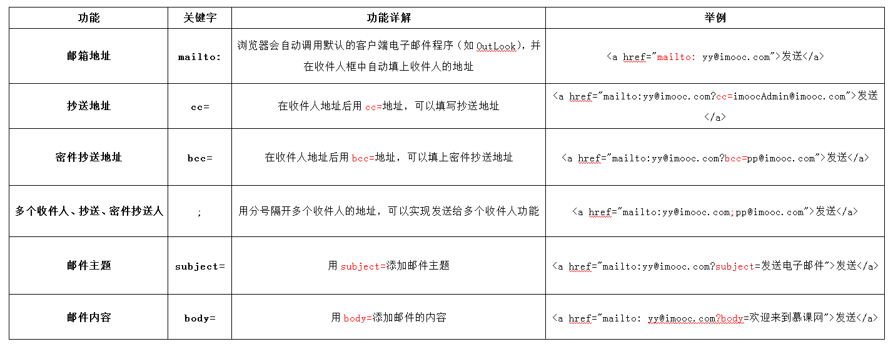
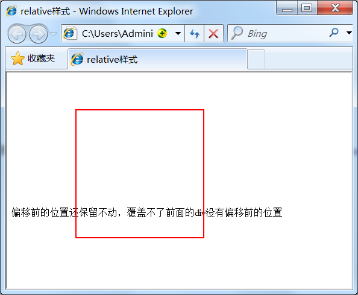

- [learn_Angular](#learn_angular)
  - [第一部分：前端基础](#第一部分前端基础)
    - [学习网址](#学习网址)
    - [我的第一网页](#我的第一网页)
    - [HTML标签的介绍](#html标签的介绍)
    - [CSS学习](#css学习)
  - [### JavaScript学习](#-javascript学习)
  - [>暂缓](#暂缓)
  - [第二部分：Angular框架](#第二部分angular框架)
    - [创建项目](#创建项目)
    - [英雄编辑器](#英雄编辑器)
    - [显示列表](#显示列表)
    - [创建特性组件](#创建特性组件)
    - [添加服务](#添加服务)
      - [可观察对象版本的 HeroService](#可观察对象版本的-heroservice)
      - [新建消息组件和服务](#新建消息组件和服务)
    - [添加导航](#添加导航)
    - [从服务端获取数据](#从服务端获取数据)
# learn_Angular

自学前端基础和Angular框架

## 第一部分：前端基础
### 学习网址
[点击此处](https://www.imooc.com/learn/9)
### 我的第一网页
学习web前端开发基础技术需要掌握：HTML、CSS、JavaScript语言。下面我们就来了解下这三门技术都是用来实现什么的：
1. HTML是网页内容的载体。内容就是网页制作者放在页面上想要让用户浏览的信息，可以包含文字、图片、视频等。
2. CSS样式是表现。就像网页的外衣。比如，标题字体、颜色变化，或为标题加入背景图片、边框等。所有这些用来改变内容外观的东西称之为表现。
3. JavaScript是用来实现网页上的特效效果。如：鼠标滑过弹出下拉菜单。或鼠标滑过表格的背景颜色改变。还有焦点新闻（新闻图片）的轮换。可以这么理解，有动画的，有交互的一般都是用JavaScript来实现的。
```html
<html>
    <head>
        <meta http-equiv="Content-Type" content="text/html; charset=utf-8">
        <title>Html和CSS的关系</title>
        <style type="text/css">
        h1{
            font-size:12px;
            color:#930;
            text-align:center;
        }
        </style>
    </head>
    <body>
        <h1>Hello World!</h1>
    </body>
</html>
```
对上面代码的解释
```text
<h></h>代表标题标签对
<p></p>代表段落标签对
标签对可以嵌套
不区分大小写，但大部分人都是小写
<html></html>是根标签
<head></head>是头部，所有头元素的容器
其中<title></title>是浏览器标签现实的文字
<body></body>显示网页在浏览器里内容
<!--XXXXX-->注释格式，不会被浏览器显示
```
### HTML标签的介绍
标签的用途：我们学习网页制作时，常常会听到一个词，语义化。那么什么叫做语义化呢，说的通俗点就是：明白每个标签的用途（在什么情况下使用此标签合理）比如，网页上的文章的标题就可以用标题标签，网页上的各个栏目的栏目名称也可以使用标题标签。文章中内容的段落就得放在段落标签中，在文章中有想强调的文本，就可以使用 em 标签表示强调等等。
讲了这么多语义化，但是语义化可以给我们带来什么样的好处呢？
1. 更容易被搜索引擎收录。
2. 更容易让屏幕阅读器读出网页内容。
```text
<hx>是标题标签，x位1-6。
<h1>是文字显示最大的标签，他一般被用在网站名称上
 强调标签有两个
①<strong>常用，会加粗显示标签中的文字
②<em>斜体表示标签中的文字
 <span></span>为文字设置单独样式
可在前面自定义一个span{}，大括号里写入各种设置，在下面的文字中，用<span></span>括住目标文字
<q></q>短文本引用，自动添加双引号，表示引用
<blockquote></blockquote>是对长文本的应用，自动添加两边缩进，看下图。
```

```text
<br />换行，最后一行文字不需要用这个空标签
与以前我们学过的标签不一样，<br />标签是一个空标签，没有HTML内容的标签就是空标签，空标签只需要写一个开始标签，这样的标签有<br />、<hr />和。
空格
输入多个空格，显示是只有一个空格
用&nbsp;叠加来显示多个空格
添加水平横线
<hr />
更多设置
width调节宽度，size调节高度，color调节颜色<hr color=”颜色” size=“高度",width="宽度" />
<address></address>标签对里填入联系方式，自动斜体表示
```

```text
<code></code>添加一行代码
<pre></pre>添加多行代码，会预格式化，显示一样的格式
添加信息列表
<ul>
<li>列表文字1</li>
<li>列表文字2</li>
</ul>
默认在前面会加上“圆点”
是无序列表
有一个有序列表
<ol>
<li>列表文字1</li>
<li>列表文字2</li>
</ol>
会在每一条信息前添加数字序号

<div></div>
在网页制作过程过中，可以把一些独立的逻辑部分划分出来，放在一个<div>标签中，这个<div>标签的作用就相当于一个容器。
语法：
<div>…</div>
确定逻辑部分：
什么是逻辑部分？它是页面上相互关联的一组元素。如网页中的独立的栏目版块，就是一个典型的逻辑部分。如下图所示：图中用红色边框标出的部分就是一个逻辑部分，就可以使用<div>标签作为容器。


给板块命名
<div  id="版块名称">…</div>

<table></table>表格
创建表格的四个元素：
table、tbody、tr、th、td
1、<table>…</table>：整个表格以<table>标记开始、</table>标记结束。
2、<tbody>…</tbody>：如果不加<thead><tbody><tfooter> , table表格加载完后才显示。加上这些表格结构， tbody包含行的内容下载完优先显示，不必等待表格结束后在显示，同时如果表格很长，用tbody分段，可以一部分一部分地显示。（通俗理解table 可以按结构一块块的显示，不在等整个表格加载完后显示。）
 
3、<tr>…</tr>：表格的一行，所以有几对tr 表格就有几行。
4、<td>…</td>：表格的一个单元格，一行中包含几对<td>...</td>，说明一行中就有几列。
5、<th>…</th>：表格的头部的一个单元格，表格表头。
6、表格中列的个数，取决于一行中数据单元格的个数。
默认没有表格线
表头：<th></th> 默认粗体并且居中显示

在head里添加 
<style type="text/css">
table tr td,th{border:1px solid #000;}
</style>
就会给表格一个这样的边框
```

```text
为表格添加摘要和标题
<table summary="摘要">
<table>
    <caption>标题文本</caption>
    <tr>
        <td>…</td>
        <td>…</td>
        …
    </tr>
…
</table>
<a href="url" title="说明文本">链接文本</a>
点击在这个标签打开url指向的网页
如果要在新标签页打开
<a href="目标网址" target="_blank">链接文字</a>
<a>标签还有一个作用是可以链接Email地址，使用mailto能让访问者便捷向网站管理者发送电子邮件。我们还可以利用mailto做许多其它事情。下面一一进行讲解，请看详细图示：
```

注意：如果mailto后面还有多个参数的话，第一个参数必须以“?”开头，后面的参数每一个都以“&”分隔。
下面是一个完整的实例:

```text
插入图片

举例：

讲解：
1、src：标识图像的位置；
2、alt：指定图像的描述性文本，当图像不可见时（下载不成功时），可看到该属性指定的文本；
3、title：提供在图像可见时对图像的描述(鼠标滑过图片时显示的文本)；
4、图像可以是GIF，PNG，JPEG格式的图像文件。

交互：表单标签
把用户输入的信息，传送到后端，便于处理
<form method="传送方式" action="服务器文件">
语法：
<form   method="传送方式"   action="服务器文件">
讲解：
1.<form> ：<form>标签是成对出现的，以<form>开始，以</form>结束。
2.action ：浏览者输入的数据被传送到的地方,比如一个PHP页面(save.php)。
3.method ： 数据传送的方式（get/post）。
<form    method="post"   action="save.php">
        <label for="username">用户名:</label>
        <input type="text" name="username" />
        <label for="pass">密码:</label>
        <input type="password" name="pass" />
</form>
注意:
1、所有表单控件（文本框、文本域、按钮、单选框、复选框等）都必须放在 <form></form> 标签之间（否则用户输入的信息可提交不到服务器上哦！）。

文本输入框、密码输入框
1、type：
   当type="text"时，输入框为文本输入框;
   当type="password"时, 输入框为密码输入框。
2、name：为文本框命名，以备后台程序ASP 、PHP使用。
3、value：为文本输入框设置默认值。(一般起到提示作用)
举例：
<form>
  姓名：
  <input type="text" name="myName">
  <br/>
  密码：
  <input type="password" name="pass">
</form>
在浏览器中显示的结果：
```

```text
大段文字，文本域
语法：
<textarea  rows="行数" cols="列数">文本</textarea>
1、<textarea>标签是成对出现的，以<textarea>开始，以</textarea>结束。
2、cols ：多行输入域的列数。
3、rows ：多行输入域的行数。
4、在<textarea></textarea>标签之间可以输入默认值。
举例：
<form  method="post" action="save.php">
        <label>联系我们</label>
        <textarea cols="50" rows="10" >在这里输入内容...</textarea>
</form>
```

```text
选择组件
语法：
<input   type="radio/checkbox"   value="值"    name="名称"   checked="checked"/>
1、type:
   当 type="radio" 时，控件为单选框
   当 type="checkbox" 时，控件为复选框
2、value：提交数据到服务器的值（后台程序PHP使用）
3、name：为控件命名，以备后台程序 ASP、PHP 使用
4、checked：当设置 checked="checked" 时，该选项被默认选中
注意:同一组的单选按钮，name 取值一定要一致，这样同一组的单选按钮才可以起到单选的作用。

下拉列表框
下拉列表在网页中也常会用到，它可以有效的节省网页空间。既可以单选、又可以多选。如下代码：
单选：
```

讲解：
 
1、value：

2、selected="selected"：
设置selected="selected"属性，则该选项就被默认选中。
在浏览器中显示的结果：

```text
多选：
在<select>标签中设置multiple="multiple"属性，就可以实现多选功能，在 windows 操作系统下，进行多选时按下Ctrl键同时进行单击（在 Mac下使用 Command +单击），可以选择多个选项。如下代码：
```


```text
提交按钮：
语法：
<input   type="submit"   value="提交">
type：只有当type值设置为submit时，按钮才有提交作用
value：按钮上显示的文字
举例：
```


```text
重置按钮：
语法：
<input type="reset" value="重置">
type：只有当type值设置为reset时，按钮才有重置作用
value：按钮上显示的文字
举例：
```


```text
lable 标签
label标签不会向用户呈现任何特殊效果，它的作用是为鼠标用户改进了可用性。如果你在 label 标签内点击文本，就会触发此控件。就是说，当用户单击选中该label标签时，浏览器就会自动将焦点转到和标签相关的表单控件上（就自动选中和该label标签相关连的表单控件上）。
语法：
<label for="控件id名称">
注意：标签的 for 属性中的值应当与相关控件的 id 属性值一定要相同。
例子：
<form>
  <label for="male">男</label>
  <input type="radio" name="gender" id="male" />
  <br />
  <label for="female">女</label>
  <input type="radio" name="gender" id="female" />
  <label for="email">输入你的邮箱地址</label>
  <input type="email" id="email" placeholder="Enter email">
</form>
```
### CSS学习
```text
CSS全称为“层叠样式表 (Cascading Style Sheets)”，它主要是用于定义HTML内容在浏览器内的显示样式，如文字大小、颜色、字体加粗等。
如下列代码：
p{
   font-size:12px;
   color:red;
   font-weight:bold;
}
下面<p></p>都是设置的样式
使用CSS样式的一个好处是通过定义某个样式，可以让不同网页位置的文字有着统一的字体、字号或者颜色等。
类似于编程语言中宏的功能
这边p是个例，谁便神马字母都可，叫选择符（选择器），如span，body部分用标签括住，就会生效

CSS注释
/*注释文字*/

内联式CSS样式
css样式代码要写在style=""双引号中，如果有多条css样式代码设置可以写在一起，中间用分号隔开。如下代码：
<p style="color:red;font-size:12px">这里文字是红色。</p>

嵌入式css样式，就是可以把css样式代码写在<style type="text/css"></style>标签之间。如下面代码实现把三个<span>标签中的文字设置为红色：
<style type="text/css">
span{
color:red;
}
</style>
嵌入式css样式必须写在<style></style>之间，并且一般情况下嵌入式css样式写在<head></head>之间。

外部式css样式(也可称为外联式)就是把css代码写一个单独的外部文件中，这个css样式文件以“.css”为扩展名，在<head>内（不是在<style>标签内）使用<link>标签将css样式文件链接到HTML文件内，如下面代码：
<link href="base.css" rel="stylesheet" type="text/css" />
注意：
1、css样式文件名称以有意义的英文字母命名，如 main.css。
2、rel="stylesheet" type="text/css" 是固定写法不可修改。
3、<link>标签位置一般写在<head>标签之内。

对于同一个元素我们同时用了三种方法设置css样式，那么哪种方法真正有效呢？
1、使用内联式CSS设置“超酷的互联网”文字为粉色。
2、然后使用嵌入式CSS来设置文字为红色。
3、最后又使用外部式设置文字为蓝色（style.css文件中设置）。
但最终你可以观察到“超酷的互联网”这个短词的文本被设置为了粉色。因为这三种样式是有优先级的，记住他们的优先级：内联式 > 嵌入式 > 外部式
但是嵌入式>外部式有一个前提：嵌入式css样式的位置一定在外部式的后面。<link href="style.css" ...>代码在<style type="text/css">...</style>代码的前面（实际开发中也是这么写的）。感兴趣的小伙伴可以试一下，把它们调换顺序，再看他们的优先级是否变化。
其实总结来说，就是--就近原则（离被设置元素越近优先级别越高）。

类选择器
语法：
.类选器名称{css样式代码;}
注意：
1、英文圆点开头
2、其中类选器名称可以任意起名（但不要起中文噢）
使用方法：
第一步：使用合适的标签把要修饰的内容标记起来，如下：
<span>胆小如鼠</span>
第二步：使用class="类选择器名称"为标签设置一个类，如下：
<span class="stress">胆小如鼠</span>
第三步：设置类选器css样式，如下：
.stress{color:red;}/*类前面要加入一个英文圆点*/（一般在head里）

ID选择器
在很多方面，ID选择器都类似于类选择符，但也有一些重要的区别：
1、为标签设置id="ID名称"，而不是class="类名称"。
2、ID选择符的前面是井号（#）号，而不是英文圆点（.）。

两者不同点
1、ID选择器只能在文档中使用一次。与类选择器不同，在一个HTML文档中，ID选择器只能使用一次，而且仅一次。而类选择器可以使用多次。(这里是多次作用元素，而不是定义一次)

2、可以使用类选择器词列表方法为一个元素同时设置多个样式。我们可以为一个元素同时设多个样式，但只可以用类选择器的方法实现，ID选择器是不可以的（因为不能使用 ID 词列表）。
下面的代码是正确的
.stress{
    color:red;
}
.bigsize{
    font-size:25px;
}
<p>到了<span class="stress bigsize">三年级</span>下学期时，我们班上了一节公开课...</p>
上面代码的作用是为“三年级”三个文字设置文本颜色为红色并且字号为25px。
下面的代码是不正确的
#stressid{
    color:red;
}
#bigsizeid{
    font-size:25px;
}
<p>到了<span id="stressid bigsizeid">三年级</span>下学期时，我们班上了一节公开课...</p>
上面代码不可以实现为“三年级”三个文字设置文本颜色为红色并且字号为25px的作用。

还有一个比较有用的选择器子选择器，即大于符号(>),用于选择指定标签元素的第一代子元素。如右侧代码编辑器中的代码：
.food>li{border:1px solid red;}
这行代码会使class名为food下的子元素li（水果、蔬菜）加入红色实线边框。

<!DOCTYPE HTML>
<html>
<head>
<meta http-equiv="Content-Type" content="text/html; charset=utf-8">
<title>子选择符</title>
<style type="text/css">
.food>li{border:1px solid red;}/*添加边框样式（粗细为1px， 颜色为红色的实线）*/
.first>span{
    border:1px solid red;
}
</style>
</head>
<body>
<p class="first">三年级时，<span>我还是一个<span>胆小如鼠</span>的小女孩</span>，上课从来不敢回答老师提出的问题，生怕回答错了老师会批评我。就一直没有这个勇气来回答老师提出的问题。学校举办的活动我也没勇气参加。</p>
<h1>食物</h1>
<ul class="food">
    <li>水果
        <ul>
        	<li>香蕉</li>
            <li>苹果</li>
            <li>梨</li>
        </ul>
    </li>
    <li>蔬菜
    	<ul>
        	<li>白菜</li>
            <li>油菜</li>
            <li>卷心菜</li>
        </ul>
    </li>
</ul>
</body>
</html>
效果：
```

包含（后代）选择器
把子选择器的 > 改成空格

变化：

```text
总结：>作用于元素的第一代后代，空格作用于元素的所有后代。

通用选择器
通用选择器是功能最强大的选择器，它使用一个（*）号指定，它的作用是匹配html中所有标签元素，如下使用下面代码使用html中任意标签元素字体颜色全部设置为红色：
* {color:red;}

伪类选择符
更有趣的是伪类选择符，为什么叫做伪类选择符，它允许给html不存在的标签（标签的某种状态）设置样式，比如说我们给html中一个标签元素的鼠标滑过的状态来设置字体颜色：
a:hover{color:red;}
上面一行代码就是为 a 标签鼠标滑过的状态设置字体颜色变红。这样就会使第一段文字内容中的“胆小如鼠”文字加入鼠标滑过字体颜色变为红色特效。
关于伪选择符：
    关于伪类选择符，到目前为止，可以兼容所有浏览器的“伪类选择符”就是 a 标签上使用 :hover 了（其实伪类选择符还有很多，尤其是 css3 中，但是因为不能兼容所有浏览器，本教程只是讲了这一种最常用的）。其实 :hover 可以放在任意的标签上，比如说 p:hover，但是它们的兼容性也是很不好的，所以现在比较常用的还是 a:hover 的组合。

分组选择符
当你想为html中多个标签元素设置同一个样式时，可以使用分组选择符（，），如下代码为右侧代码编辑器中的h1、span标签同时设置字体颜色为红色：
h1,span{color:red;}
它相当于下面两行代码：
h1{color:red;}
span{color:red;}

CSS的继承
继承是一种规则，它允许样式不仅应用于某个特定html标签元素，而且应用于其后代。比如下面代码：如某种颜色应用于p标签，这个颜色设置不仅应用p标签，还应用于p标签中的所有子元素文本，这里子元素为span标签。
p{color:red;}
<p>三年级时，我还是一个<span>胆小如鼠</span>的小女孩。</p>
可见右侧结果窗口中p中的文本与span中的文本都设置为了红色。但注意有一些css样式是不具有继承性的。如border:1px solid red;
p{border:1px solid red;}
<p>三年级时，我还是一个<span>胆小如鼠</span>的小女孩。</p>
在上面例子中它代码的作用只是给p标签设置了边框为1像素、红色、实心边框线，而对于子元素span是没用起到作用的。

权值决定用哪个样式
下面是权值的规则：
标签的权值为1，类选择符的权值为10，ID选择符的权值最高为100。例如下面的代码：
p{color:red;} /*权值为1*/
p span{color:green;} /*权值为1+1=2*/
.warning{color:white;} /*权值为10*/
p span.warning{color:purple;} /*权值为1+1+10=12*/
#footer .note p{color:yellow;} /*权值为100+10+1=111*/
注意：还有一个权值比较特殊--继承也有权值但很低，有的文献提出它只有0.1，所以可以理解为继承的权值最低。

当权值相同时，会出现层叠，后面的属性会覆盖前面的属性

我们在做网页代码的时，有些特殊的情况需要为某些样式设置具有最高权值，怎么办？这时候我们可以使用!important来解决。
如下代码：
p{color:red!important;}
p{color:green;}
<p class="first">三年级时，我还是一个<span>胆小如鼠</span>的小女孩。</p>
这时 p 段落中的文本会显示的red红色。
注意：!important要写在分号的前面
这里注意当网页制作者不设置css样式时，浏览器会按照自己的一套样式来显示网页。并且用户也可以在浏览器中设置自己习惯的样式，比如有的用户习惯把字号设置为大一些，使其查看网页的文本更加清楚。这时注意样式优先级为：浏览器默认的样式 < 网页制作者样式 < 用户自己设置的样式，但记住!important优先级样式是个例外，权值高于用户自己设置的样式。

字体设置
不要用偏僻字体，用大家电脑里都有的，比如微软雅黑
body{font-family:"Microsoft Yahei";}
或
body{font-family:"微软雅黑";}
注意：第一种方法比第二种方法兼容性更好一些。

字号和颜色
可以使用下面代码设置网页中文字的字号为12像素，并把字体颜色设置为#666(灰色)：
body{font-size:12px;color:#666}

文字排版--粗体
我们还可以使用css样式来改变文字的样式：粗体、斜体、下划线、删除线，可以使用下面代码实现设置文字以粗体样式显示出来。
p span{font-weight:bold;}
在这里大家可以看到，如果想为文字设置粗体是有单独的css样式来实现的，再不用为了实现粗体样式而使用h1-h6或strong标签了。

以下代码可以实现文字以斜体样式在浏览器中显示：
p a{font-style:italic;}

添加下划线
p a{text-decoration:underline;}

删除线
 .oldPrice{text-decoration:line-through;}

缩进
中文文字中的段前习惯空两个文字的空白，这个特殊的样式可以用下面代码来实现：
p{text-indent:2em;}
2em是两倍文字大小的意思

这一小节我们来学习一下另一个在段落排版中起重要作用的行间距（行高）属性（line-height），如下代码实现设置段落行间距为1.5倍。
p{line-height:1.5em;}

中文或字母间距
h1{letter-spacing:50px;}

单词间距
h1{word-spacing:50px;}

块状元素、图片 居左中右
h1{text-align:left/center/right;}

元素分类
在讲解CSS布局之前，我们需要提前知道一些知识，在CSS中，html中的标签元素大体被分为三种不同的类型：块状元素、内联元素(又叫行内元素)和内联块状元素。
常用的块状元素有：
<div>、<p>、<h1>...<h6>、<ol>、<ul>、<dl>、<table>、<address>、<blockquote> 、<form>
常用的内联元素有：
<a>、<span>、<br>、<i>、<em>、<strong>、<label>、<q>、<var>、<cite>、<code>
常用的内联块状元素有：
、<input>

在html中<div>、 <p>、<h1>、<form>、<ul> 和 <li>就是块级元素。设置display:block就是将元素显示为块级元素。如下代码就是将内联元素a转换为块状元素，从而使a元素具有块状元素特点。
a{display:block;}
块级元素特点：
1、每个块级元素都从新的一行开始，并且其后的元素也另起一行。（真霸道，一个块级元素独占一行）
2、元素的高度、宽度、行高以及顶和底边距都可设置。
3、元素	宽度在不设置的情况下，是它本身父容器的100%（和父元素的宽度一致），除非设定一个宽度。

在html中，<span>、<a>、<label>、 <strong> 和<em>就是典型的内联元素（行内元素）（inline）元素。当然块状元素也可以通过代码display:inline将元素设置为内联元素。如下代码就是将块状元素div转换为内联元素，从而使 div 元素具有内联元素特点。
 div{
     display:inline;
 }
<div>我要变成内联元素</div>
内联元素特点：
1、和其他元素都在一行上；
2、元素的高度、宽度及顶部和底部边距不可设置；
3、元素的宽度就是它包含的文字或图片的宽度，不可改变。

内联块状元素（inline-block）就是同时具备内联元素、块状元素的特点，代码display:inline-block就是将元素设置为内联块状元素。(css2.1新增)，、<input>标签就是这种内联块状标签。
inline-block 元素特点：
1、和其他元素都在一行上；
2、元素的高度、宽度、行高以及顶和底边距都可设置。

盒子模型的边框就是围绕着内容及补白的线，这条线你可以设置它的粗细、样式和颜色(边框三个属性)。
如下面代码为 div 来设置边框粗细为 2px、样式为实心的、颜色为红色的边框：
div{
    border:2px  solid  red;
}
上面是 border 代码的缩写形式，可以分开写：
div{
    border-width:2px;
    border-style:solid;
    border-color:red;
}
注意：
1、border-style（边框样式）常见样式有：
dashed（虚线）| dotted（点线）| solid（实线）。

2、border-color（边框颜色）中的颜色可设置为十六进制颜色，如:
border-color:#888;//前面的井号不要忘掉。

3、border-width（边框宽度）中的宽度也可以设置为：
thin | medium | thick（但不是很常用），最常还是用像素（px）。

css 样式中允许只为一个方向的边框设置样式：
div{border-bottom:1px solid red;}
同样可以使用下面代码实现其它三边(上、右、左)边框的设置：
border-top:1px solid red;
border-right:1px solid red; 
border-left:1px solid red;

盒模型宽度和高度和我们平常所说的物体的宽度和高度理解是不一样的，css内定义的宽（width）和高（height），指的是填充以里的内容范围。
因此一个元素实际宽度（盒子的宽度）=左边界+左边框+左填充+内容宽度+右填充+右边框+右边界。
```

```text
元素的高度也是同理。
比如：
css代码：
div{
    width:200px;
    padding:20px;
    border:1px solid red;
    margin:10px;    
}
html代码：
<body>
   <div>文本内容</div>
</body>
元素的实际长度为：10px+1px+20px+200px+20px+1px+10px=262px。在chrome浏览器下可查看元素盒模型，如下图：
```

```text
元素内容与边框之间是可以设置距离的，称之为“填充”。填充也可分为上、右、下、左(顺时针)。如下代码：
div{padding:20px 10px 15px 30px;}
顺序一定不要搞混。可以分开写上面代码：
div{
   padding-top:20px;
   padding-right:10px;
   padding-bottom:15px;
   padding-left:30px;
}
如果上、右、下、左的填充都为10px;可以这么写
div{padding:10px;}
如果上下填充一样为10px，左右一样为20px，可以这么写：
div{padding:10px 20px;}

盒模型--边界
元素与其它元素之间的距离可以使用边界（margin）来设置。边界也是可分为上、右、下、左。如下代码：
div{margin:20px 10px 15px 30px;}
也可以分开写：
div{
   margin-top:20px;
   margin-right:10px;
   margin-bottom:15px;
   margin-left:30px;
}
如果上右下左的边界都为10px;可以这么写：
div{ margin:10px;}
如果上下边界一样为10px，左右一样为20px，可以这么写：
div{ margin:10px 20px;}
总结一下：padding和margin的区别，padding在边框里，margin在边框外。

先来说一说流动模型，流动（Flow）是默认的网页布局模式。也就是说网页在默认状态下的 HTML 网页元素都是根据流动模型来分布网页内容的。
流动布局模型具有2个比较典型的特征：
第一点，块状元素都会在所处的包含元素内自上而下按顺序垂直延伸分布，因为在默认状态下，块状元素的宽度都为100%。实际上，块状元素都会以行的形式占据位置。如右侧代码编辑器中三个块状元素标签(div，h1，p)宽度显示为100%。

第二点，在流动模型下，内联元素都会在所处的包含元素 内从左到右水平分布显示。（内联元素可不像块状元素这么霸道独占一行）
右侧代码编辑器中内联元素标签a、span、em、strong都是内联元素。

块状元素这么霸道都是独占一行，如果现在我们想让两个块状元素并排显示，怎么办呢？不要着急，设置元素浮动就可以实现这一愿望。
任何元素在默认情况下是不能浮动的，但可以用 CSS 定义为浮动，如 div、p、table、img 等元素都可以被定义为浮动。如下代码可以实现两个 div 元素一行显示。
div{
    width:200px;
    height:200px;
    border:2px red solid;
    float:left;
}
<div id="div1"></div>
<div id="div2"></div>
效果图
```

```text
当然你也可以同时设置两个元素右浮动也可以实现一行显示。
div{
    width:200px;
    height:200px;
    border:2px red solid;
    float:right;
}
效果图
```

```text
又有小伙伴问了，设置两个元素一左一右可以实现一行显示吗？当然可以：
div{
    width:200px;
    height:200px;
    border:2px red solid;
}
#div1{float:left;}
#div2{float:right;}
效果图
```

```text
当宽度不够时，两个元素并行显示
如果想为元素设置层模型中的绝对定位，需要设置position:absolute(表示绝对定位)，这条语句的作用将元素从文档流中拖出来，然后使用left、right、top、bottom属性相对于其最接近的一个具有定位属性的父包含块进行绝对定位。如果不存在这样的包含块，则相对于body元素，即相对于浏览器窗口。
如下面代码可以实现div元素相对于浏览器窗口向右移动100px，向下移动50px。
div{
    width:200px;
    height:200px;
    border:2px red solid;
    position:absolute;
    left:100px;
    top:50px;
}
<div id="div1"></div>
效果如下：
```

```text
如果想为元素设置层模型中的相对定位，需要设置position:relative（表示相对定位），它通过left、right、top、bottom属性确定元素在正常文档流中的偏移位置。相对定位完成的过程是首先按static(float)方式生成一个元素(并且元素像层一样浮动了起来)，然后相对于以前的位置移动，移动的方向和幅度由left、right、top、bottom属性确定，偏移前的位置保留不动。
如下代码实现相对于以前位置向下移动50px，向右移动100px;
#div1{
    width:200px;
    height:200px;
    border:2px red solid;
    position:relative;
    left:100px;
    top:50px;
}
<div id="div1"></div>
效果图：
```

```text
什么叫做“偏移前的位置保留不动”呢？
大家可以做一个实验，在右侧代码编辑器的19行div标签的后面加入一个span标签，在标并在span标签中写入一些文字。如下代码：
<body>
    <div id="div1"></div><span>偏移前的位置还保留不动，覆盖不了前面的div没有偏移前的位置</span>
</body>
效果图：
```

```text
从效果图中可以明显的看出，虽然div元素相对于以前的位置产生了偏移，但是div元素以前的位置还是保留着，所以后面的span元素是显示在了div元素以前位置的后面。
偏移前最好不要有元素占据

fixed：表示固定定位，与absolute定位类型类似，但它的相对移动的坐标是视图（屏幕内的网页窗口）本身。由于视图本身是固定的，它不会随浏览器窗口的滚动条滚动而变化，除非你在屏幕中移动浏览器窗口的屏幕位置，或改变浏览器窗口的显示大小，因此固定定位的元素会始终位于浏览器窗口内视图的某个位置，不会受文档流动影响，这与background-attachment:fixed;属性功能相同。以下代码可以实现相对于浏览器视图向右移动100px，向下移动50px。并且拖动滚动条时位置固定不变。
#div1{
    width:200px;
    height:200px;
    border:2px red solid;
    position:fixed;
    left:100px;
    top:50px;
}
<p>文本文本文本文本文本文本文本文本文本文本文本文本文本文本文本文本文本文本文本文本文本文本文本文本文本文本文本文本文本文本文本文本文本文本。</p>
....

就是始终在浏览器窗口那个位置

使用position:absolute可以实现被设置元素相对于浏览器（body）设置定位以后，大家有没有想过可不可以相对于其它元素进行定位呢？答案是肯定的，当然可以。使用position:relative来帮忙，但是必须遵守下面规范：
1、参照定位的元素必须是相对定位元素的前辈元素：
<div id="box1"><!--参照定位的元素-->
    <div id="box2">相对参照元素进行定位</div><!--相对定位元素-->
</div>
从上面代码可以看出box1是box2的父元素（父元素当然也是前辈元素了）。
2、参照定位的元素必须加入position:relative;
#box1{
    width:200px;
    height:200px;
    position:relative;        
}
3、定位元素加入position:absolute，便可以使用top、bottom、left、right来进行偏移定位了。
#box2{
    position:absolute;
    top:20px;
    left:30px;         
}
这样box2就可以相对于父元素box1定位了（这里注意参照物就可以不是浏览器了，而可以自由设置了）。

还记得在讲盒模型时外边距(margin)、内边距(padding)和边框(border)设置上下左右四个方向的边距是按照顺时针方向设置的：上右下左。具体应用在margin和padding的例子如下：
margin:10px 15px 12px 14px;/*上设置为10px、右设置为15px、下设置为12px、左设置为14px*/
通常有下面三种缩写方法:
1、如果top、right、bottom、left的值相同，如下面代码：
margin:10px 10px 10px 10px;
可缩写为：
margin:10px;
2、如果top和bottom值相同、left和 right的值相同，如下面代码：
margin:10px 20px 10px 20px;
可缩写为：
margin:10px 20px;
3、如果left和right的值相同，如下面代码：
margin:10px 20px 30px 20px;
可缩写为：
margin:10px 20px 30px;
注意：padding、border的缩写方法和margin是一致的。

关于颜色的css样式也是可以缩写的，当你设置的颜色是16进制的色彩值时，如果每两位的值相同，可以缩写一半。
例子1：
p{color:#000000;}
可以缩写为：
p{color: #000;}
例子2：
p{color: #336699;}
可以缩写为：
p{color: #369;}

网页中的字体css样式代码也有他自己的缩写方式，下面是给网页设置字体的代码：
body{
    font-style:italic;
    font-variant:small-caps; 
    font-weight:bold; 
    font-size:12px; 
    line-height:1.5em; 
    font-family:"宋体",sans-serif;
}
这么多行的代码其实可以缩写为一句：
body{
    font:italic  small-caps  bold  12px/1.5em  "宋体",sans-serif;
}
注意：
1、使用这一简写方式你至少要指定 font-size 和 font-family 属性，其他的属性(如 font-weight、font-style、font-variant、line-height)如未指定将自动使用默认值。
2、在缩写时 font-size 与 line-height 中间要加入“/”斜扛。
一般情况下因为对于中文网站，英文还是比较少的，所以下面缩写代码比较常用：
body{
    font:12px/1.5em  "宋体",sans-serif;
}
只是有字号、行间距、中文字体、英文字体设置。

在网页中的颜色设置是非常重要，有字体颜色（color）、背景颜色（background-color）、边框颜色（border）等，设置颜色的方法也有很多种：
1、英文命令颜色
前面几个小节中经常用到的就是这种设置方法：
p{color:red;}
2、RGB颜色
这个与 photoshop 中的 RGB 颜色是一致的，由 R(red)、G(green)、B(blue) 三种颜色的比例来配色。
p{color:rgb(133,45,200);}
每一项的值可以是 0~255 之间的整数，也可以是 0%~100% 的百分数。如：
p{color:rgb(20%,33%,25%);}
3、十六进制颜色
这种颜色设置方法是现在比较普遍使用的方法，其原理其实也是 RGB 设置，但是其每一项的值由 0-255 变成了十六进制 00-ff。
p{color:#00ffff;}
配色表：
```


```text
长度单位总结一下，目前比较常用到px（像素）、em、% 百分比，要注意其实这三种单位都是相对单位。
1、像素
像素为什么是相对单位呢？因为像素指的是显示器上的小点（CSS规范中假设“90像素=1英寸”）。实际情况是浏览器会使用显示器的实际像素值有关，在目前大多数的设计者都倾向于使用像素（px）作为单位。
2、em
就是本元素给定字体的 font-size 值，如果元素的 font-size 为 14px ，那么 1em = 14px；如果 font-size 为 18px，那么 1em = 18px。如下代码：
p{font-size:12px;text-indent:2em;}
上面代码就是可以实现段落首行缩进 24px（也就是两个字体大小的距离）。
下面注意一个特殊情况：
但当给 font-size 设置单位为 em 时，此时计算的标准以 p 的父元素的 font-size 为基础。如下代码：
html:
<p>以这个<span>例子</span>为例。</p>
css:
p{font-size:14px}
span{font-size:0.8em;}
结果 span 中的字体“例子”字体大小就为 11.2px（14 * 0.8 = 11.2px）。
3、百分比
p{font-size:12px;line-height:130%}
设置行高（行间距）为字体的130%（12 * 1.3 = 15.6px）。

我们在实际工作中常会遇到需要设置水平居中的场景，比如为了美观，文章的标题一般都是水平居中显示的。
这里我们又得分两种情况：行内元素 还是 块状元素 ，块状元素里面又分为定宽块状元素，以及不定宽块状元素。今天我们先来了解一下行内元素怎么进行水平居中？
如果被设置元素为文本、图片等行内元素时，水平居中是通过给父元素设置 text-align:center 来实现的。(父元素和子元素：如下面的html代码中，div是“我想要在父容器中水平居中显示”这个文本的父元素。反之这个文本是div的子元素 )如下代码：
html代码：
<body>
  <div class="txtCenter">我想要在父容器中水平居中显示。</div>
</body>
css代码：
<style>
  .txtCenter{
    text-align:center;
  }
</style>

当被设置元素为 块状元素 时用 text-align：center 就不起作用了，这时也分两种情况：定宽块状元素和不定宽块状元素。
这一小节我们先来讲一讲定宽块状元素。(定宽块状元素：块状元素的宽度width为固定值。)
满足定宽和块状两个条件的元素是可以通过设置“左右margin”值为“auto”来实现居中的。我们来看个例子就是设置 div 这个块状元素水平居中：
html代码：
<body>
  <div>我是定宽块状元素，哈哈，我要水平居中显示。</div>
</body>
css代码：
<style>
div{
    border:1px solid red;/*为了显示居中效果明显为 div 设置了边框*/
    
    width:200px;/*定宽*/
    margin:20px auto;/* margin-left 与 margin-right 设置为 auto */
}
</style>
也可以写成：
margin-left:auto;
margin-right:auto;
注意：元素的“上下 margin” 是可以随意设置的。

在实际工作中我们会遇到需要为“不定宽度的块状元素”设置居中，比如网页上的分页导航，因为分页的数量是不确定的，所以我们不能通过设置宽度来限制它的弹性。(不定宽块状元素：块状元素的宽度width不固定。)
不定宽度的块状元素有三种方法居中（这三种方法目前使用盒子模型的都很多）：
1. 加入 table 标签
2. 设置 display: inline 方法：与第一种类似，显示类型设为 行内元素，进行不定宽元素的属性设置
3. 设置 position:relative 和 left:50%：利用 相对定位 的方式，将元素向左偏移 50% ，即达到居中的目的
这一小节我们来讲一下第一种方法：
为什么选择方法一加入table标签? 是利用table标签的长度自适应性---即不定义其长度也不默认父元素body的长度（table其长度根据其内文本长度决定），因此可以看做一个定宽度块元素，然后再利用定宽度块状居中的margin的方法，使其水平居中。
第一步：为需要设置的居中的元素外面加入一个 table 标签 ( 包括 <tbody>、<tr>、<td> )。
第二步：为这个 table 设置“左右 margin 居中”（这个和定宽块状元素的方法一样）。
举例如下：
html代码：
<div>
 <table>
  <tbody>
    <tr><td>
    <ul>
        <li>我是第一行文本</li>
        <li>我是第二行文本</li>
        <li>我是第三行文本</li>
    </ul>
    </td></tr>
  </tbody>
 </table>
</div>
css代码：
<style>
table{
    border:1px solid;
    margin:0 auto;
}
</style>

除了上一节讲到的插入table标签，可以使不定宽块状元素水平居中之外，本节介绍第2种实现这种效果的方法，改变元素的display类型为行内元素，利用其属性直接设置。
第二种方法：改变块级元素的 display 为 inline 类型（设置为 行内元素 显示），然后使用 text-align:center 来实现居中效果。如下例子：
html代码：
<body>
<div class="container">
    <ul>
        <li><a href="#">1</a></li>
        <li><a href="#">2</a></li>
        <li><a href="#">3</a></li>
    </ul>
</div>
</body>
css代码：
<style>
.container{
    text-align:center;
}
/* margin:0;padding:0（消除文本与div边框之间的间隙）*/
.container ul{
    list-style:none;
    margin:0;
    padding:0;
    display:inline;
}
/* margin-right:8px（设置li文本之间的间隔）*/
.container li{
    margin-right:8px;
    display:inline;
}
</style>
这种方法相比第一种方法的优势是不用增加无语义标签，但也存在着一些问题：它将块状元素的 display 类型改为 inline，变成了行内元素，所以少了一些功能，比如设定长度值。

除了前两节讲到的插入table标签，以及改变元素的display类型，可以使不定宽块状元素水平居中之外，本节介绍第3种实现这种效果的方法，设置浮动和相对定位来实现。
方法三：通过给父元素设置 float，然后给父元素设置 position:relative 和 left:50%，子元素设置 position:relative 和 left: -50% 来实现水平居中。
我们可以这样理解：假想ul层的父层（即下面例子中的div层）中间有条平分线将ul层的父层（div层）平均分为两份，ul层的css代码是将ul层的最左端与ul层的父层（div层）的平分线对齐；而li层的css代码则是将li层的平分线与ul层的最左端（也是div层的平分线）对齐，从而实现li层的居中。
 
代码如下：
<body>
<div class="container">
    <ul>
        <li><a href="#">1</a></li>
        <li><a href="#">2</a></li>
        <li><a href="#">3</a></li>
    </ul>
</div>
</body>
css代码：
<style>
.container{
    float:left;
    position:relative;
    left:50%
}
.container ul{
    list-style:none;
    margin:0;
    padding:0;
    
    position:relative;
    left:-50%;
}
.container li{float:left;display:inline;margin-right:8px;}
</style>
 
这三种方法使用得都非常广泛，各有优缺点，具体选用哪种方法，可以视具体情况而定。

父元素高度确定的多行文本、图片等的竖直居中的方法有两种：
方法一：使用插入 table  (包括tbody、tr、td)标签，同时设置 vertical-align：middle。
css 中有一个用于竖直居中的属性 vertical-align，在父元素设置此样式时，会对inline-block类型的子元素都有用。下面看一下例子：
html代码：
<body>
<table><tbody><tr><td class="wrap">
<div>
    <p>看我是否可以居中。</p>
</div>
</td></tr></tbody></table>
</body>
css代码：
table td{height:500px;background:#ccc}
因为 td 标签默认情况下就默认设置了 vertical-align 为 middle，所以我们不需要显式地设置了。

除了上一节讲到的插入table标签，可以使父元素高度确定的多行文本垂直居中之外，本节介绍另外一种实现这种效果的方法。但这种方法兼容性比较差，只是提供大家学习参考。
在 chrome、firefox 及 IE8 以上的浏览器下可以设置块级元素的 display 为 table-cell（设置为表格单元显示），激活 vertical-align 属性，但注意 IE6、7 并不支持这个样式, 兼容性比较差。
html代码：
<div class="container">
    <div>
        <p>看我是否可以居中。</p>
        <p>看我是否可以居中。</p>
        <p>看我是否可以居中。</p>
    </div>
</div>
css代码：
<style>
.container{
    height:300px;
    background:#ccc;
    display:table-cell;/*IE8以上及Chrome、Firefox*/
    vertical-align:middle;/*IE8以上及Chrome、Firefox*/
}
</style>
这种方法的好处是不用添加多余的无意义的标签，但缺点也很明显，它的兼容性不是很好，不兼容 IE6、7而且这样修改display的block变成了table-cell，破坏了原有的块状元素的性质。

有一个有趣的现象就是当为元素（不论之前是什么类型元素，display:none 除外）设置以下 2 个句之一：
 1. position : absolute 
 2. float : left 或 float:right 
简单来说，只要html代码中出现以上两句之一，元素的display显示类型就会自动变为以 display:inline-block（块状元素）的方式显示，当然就可以设置元素的 width 和 height 了，且默认宽度不占满父元素。
面的代码，小伙伴们都知道 a 标签是 行内元素 ，所以设置它的 width 是 没有效果的，但是设置为 position:absolute 以后，就可以了。
<div class="container">如下
    <a href="#" title="">进入课程请单击这里</a>
</div>
css代码
<style>
.container a{
    position:absolute;
    width:200px;
    background:#ccc;
}
</style>
```
### JavaScript学习
---
>暂缓
---

## 第二部分：Angular框架
点击[这里](https://angular.cn/)访问angular官方文档

英雄教程，完成以下需求
- 使用 Angular 的内置指令来显示 / 隐藏元素，并显示英雄数据的列表。
- 创建 Angular 组件以显示英雄的详情，并显示一个英雄数组。
- 为只读数据使用单向数据绑定。
- 添加可编辑字段，使用双向数据绑定来更新模型。
- 把组件中的方法绑定到用户事件上，比如按键和点击。
- 让用户可以在主列表中选择一个英雄，然后在详情视图中编辑他。
- 使用管道来格式化数据。
- 创建共享的服务来管理这些英雄。
- 使用路由在不同的视图及其组件之间导航。
### 创建项目
`ng new angular-tour-of-heroes`将创建Angular项目
```shell
cd angular-tour-of-heroes
ng serve --open
##--open 标志会打开浏览器，并访问 http://localhost:4200/。
```
看到的页面就是应用的外壳，这个外壳是被一个名叫 AppComponent 的 Angular 组件控制的。

组件是 Angular 应用中的基本构造块。 它们在屏幕上显示数据，监听用户输入，并且根据这些输入执行相应的动作。
- 更改标题
1. 打开`app.component.ts`,写入`title = 'Tour of Heroes';`
2. 打开`app.component.html`，写入`<h1>{{title}}</h1>`
>双花括号语法是 Angular 的插值绑定语法。 这个插值绑定的意思是把组件的 title 属性的值绑定到 HTML 中的 h1 标记中。
- 全局样式
  路径：`src/styles.css`
### 英雄编辑器
应用程序现在有了基本的标题。 接下来你要创建一个新的组件来显示英雄信息并且把这个组件放到应用程序的外壳里去。

`ng generate component heroes`创建一个新的组件，实际帮我们创建一个文件夹，里面有四个文件分别是html、css、ts、和一个测试的ts；并且帮我们把组件声明到`src\app\app.module.ts`中。

在该组件的ts文件中，cli工具自动从angular的核心库`@angular/core`导入` Component, OnInit `这两个符号

@Component 是个装饰器函数，用于为该组件指定 Angular 所需的元数据。

CLI 自动生成了三个元数据属性：

1. selector— 组件的选择器（CSS 元素选择器）

2. templateUrl— 组件模板文件的位置。

3. styleUrls— 组件私有 CSS 样式表文件的位置。

>CSS 元素选择器 app-heroes 用来在父组件的模板中匹配 HTML 元素的名称，以识别出该组件。

>ngOnInit() 是一个生命周期钩子，Angular 在创建完组件后很快就会调用 ngOnInit()。这里是放置初始化逻辑的好地方。

>始终要 export 这个组件类，以便在其它地方（比如 AppModule）导入它。
- 下面添加一个hero属性：在ts文件写入`hero = 'Windstorm';`
- 在html中写入：`<h2>{{hero}}</h2>`
- 如果要在页面上显示这个组件，那么就要把他加入到壳组件的模板中，就是在壳组件的html中加上`<app-heroes></app-heroes>`,上面提到的CSS元素选择器

这是单个英雄，单个属性的情况，如果我们想要显示多个属性，要在app目录新建一个英雄类hero.ts
```typescript
export interface Hero {
  id: number;
  name: string;
}
```
- 然后我们到heroes组件中导入它,并且初始化一个英雄
```typescript
import { Component, OnInit } from '@angular/core';
import { Hero } from '../hero';

@Component({
  selector: 'app-heroes',
  templateUrl: './heroes.component.html',
  styleUrls: ['./heroes.component.css']
})
export class HeroesComponent implements OnInit {
  hero: Hero = {
    id: 1,
    name: 'Windstorm'
  };

  constructor() { }

  ngOnInit(): void {
  }

}
```
我们修改组件的html来显示hero类，之前是显示字符串
- 另外要提到的是：我们可以用内置管道来对文本进行格式化，如`<h2>{{hero.name | uppercase}} Details</h2>`就是进行全部大写

下面就来到了我们将提供一个输入框来随时更改并更新英雄的名字，也就是说这个输入框要能够同时修改并显示英雄名称，即数据流从组件到屏幕，且从屏幕到组件，这就要求`input`和组件的`hero.name`建立双向数据绑定。
- 组件的html中添加
```html
<div>
  <label for="name">Hero name: </label>
  <input id="name" [(ngModel)]="hero.name" placeholder="name">
</div>
```
- [(ngModel)] 是 Angular 的双向数据绑定语法。
>这里把 hero.name 属性绑定到了 HTML 的 textbox 元素上，以便数据流可以双向流动：从 hero.name 属性流动到 textbox，并且从 textbox 流回到 hero.name。

不过，页面可能会提示ngModel不可用，它属于一个可选模块 FormsModule，你必须自行添加此模块才能使用该指令。

- 到我们之前提到的`src\app\app.module.ts`中导入元数据吧
```typescript
import { FormsModule } from '@angular/forms'; // <-- NgModel lives here
imports: [
  FormsModule
],
```
### 显示列表
多个属性我们现在可以展示，那么我们现在来展示多个英雄吧。
- 创建模拟（mock）的英雄数据

你需要一些英雄数据以供显示。最终，你会从远端的数据服务器获取它。 不过目前，你要先创建一些模拟的英雄数据，并假装它们是从服务器上取到的。在 src/app/ 文件夹中创建一个名叫 mock-heroes.ts 的文件。 定义一个包含十个英雄的常量数组 HEROES，并导出它。该文件是这样的。
```ts
import { Hero } from './hero';

export const HEROES: Hero[] = [
  { id: 11, name: 'Dr Nice' },
  { id: 12, name: 'Narco' },
  { id: 13, name: 'Bombasto' },
  { id: 14, name: 'Celeritas' },
  { id: 15, name: 'Magneta' },
  { id: 16, name: 'RubberMan' },
  { id: 17, name: 'Dynama' },
  { id: 18, name: 'Dr IQ' },
  { id: 19, name: 'Magma' },
  { id: 20, name: 'Tornado' }
];
```
- 随后我们在heroes中导入并暴露这个数组
```typescript
import { HEROES } from '../mock-heroes';
export class HeroesComponent implements OnInit {

  heroes = HEROES;
}
```
- 随后我们要在html展示这个数组

使用`*ngFor`复写器和`<ul><li>`来展示
```html
<h2>My Heroes</h2>
<ul class="heroes">
  <li *ngFor="let hero of heroes">
    <span class="badge">{{hero.id}}</span> {{hero.name}}
  </li>
</ul>
```
- 如果我们想要这个列表有一些样式，除了在之前的style.css里添加，也可以在该模板的css中写，因为在ts元数据中已经引入了该文件
```css
/* HeroesComponent's private CSS styles */
.heroes {
  margin: 0 0 2em 0;
  list-style-type: none;
  padding: 0;
  width: 15em;
}
.heroes li {
  cursor: pointer;
  position: relative;
  left: 0;
  background-color: #EEE;
  margin: .5em;
  padding: .3em 0;
  height: 1.6em;
  border-radius: 4px;
}
.heroes li:hover {
  color: #2c3a41;
  background-color: #e6e6e6;
  left: .1em;
}
.heroes li.selected {
  background-color: black;
  color: white;
}
.heroes li.selected:hover {
  background-color: #505050;
  color: white;
}
.heroes li.selected:active {
  background-color: black;
  color: white;
}
.heroes .badge {
  display: inline-block;
  font-size: small;
  color: white;
  padding: 0.8em 0.7em 0 0.7em;
  background-color:#405061;
  line-height: 1em;
  position: relative;
  left: -1px;
  top: -4px;
  height: 1.8em;
  margin-right: .8em;
  border-radius: 4px 0 0 4px;
}

input {
  padding: .5rem;
}
```
- 我们回到正题，如何显示详情：可以在li中添加click事件绑定，随后由该时间来显示。`<li *ngFor="let hero of heroes" (click)="onSelect(hero)">`
- 随后我们就要编写实现onSelect(hero)方法了

在该组件的ts中写入
```typescript
selectedHero?: Hero;
onSelect(hero: Hero): void {
  this.selectedHero = hero;
}
```
- 随后我们在模板（html）中，添加显示代码
```html
<div *ngIf="selectedHero">

<h2>{{selectedHero.name | uppercase}} Details</h2>
<div><span>id: </span>{{selectedHero.id}}</div>
<div>
  <label for="hero-name">Hero name: </label>
  <input id="hero-name" [(ngModel)]="selectedHero.name" placeholder="name">
</div>

</div>
```
>注意这段代码使用`*ngIf`来包裹，意思是，只有当selectedHero有值时才显示，如若不然，没有值也强行显示这段代码，会报错：selectedHero为定义。
- 这边可以另外说下，如果我们想要一个英雄被选中后，有不同的样式，我们可以这样做：把`[class.selected]="hero === selectedHero"`加到li标签中，这样可以动态地变换样式了。
### 创建特性组件
此刻，HeroesComponent 同时显示了英雄列表和所选英雄的详情。

把所有特性都放在同一个组件中，将会使应用“长大”后变得不可维护。 你要把大型组件拆分成小一点的子组件，每个子组件都要集中精力处理某个特定的任务或工作流。

本页面中，你将迈出第一步 —— 把英雄详情移入一个独立的、可复用的 HeroDetailComponent。HeroesComponent 将仅仅用来表示英雄列表。 HeroDetailComponent 将用来表示所选英雄的详情。

使用下面的命令创建一个新的组件
```shell
ng generate component hero-detail
```
- 现在我们需要把之前在heroes组件里写详情代码剪切到HeroDetail组件的html中，在之前我们为了区分选中和没选中，这段代码的命名是selectedHero，但是现在，在单独的组件中我们最好把它改为hero
```html
<div *ngIf="hero">

  <h2>{{hero.name | uppercase}} Details</h2>
  <div><span>id: </span>{{hero.id}}</div>
  <div>
    <label for="hero-name">Hero name: </label>
    <input id="hero-name" [(ngModel)]="hero.name" placeholder="name">
  </div>

</div>
```
- 之后我们在组件的ts文件中中导入hero类
```ts
import { Hero } from '../hero';
```
- 然而现在的hero是别的组件提供的，所以要有@Input()来修饰
我们修改ts文件
```ts
import { Component, OnInit, Input } from '@angular/core';

@Input() hero?: Hero;
```
- 现在，如果我们想要显示新建的组件，那么我们要在heroes的模板中添加CSS选择器
```html
<app-hero-detail [hero]="selectedHero"></app-hero-detail>
```
- 可以说Heroes和HeroesDetail组件时父子组件，父组件通过参数传递来控制子组件
>[hero]="selectedHero" 是 Angular 的属性绑定语法。
>这是一种单向数据绑定。从 HeroesComponent 的 selectedHero 属性绑定到目标元素的 hero 属性，并映射到了 HeroDetailComponent 的 hero 属性。
>现在，当用户在列表中点击某个英雄时，selectedHero 就改变了。 当 selectedHero 改变时，属性绑定会修改 HeroDetailComponent 的 hero 属性，HeroDetailComponent 就会显示这个新的英雄。

### 添加服务

- 为什么我们需要服务
>组件不应该直接获取或保存数据，它们不应该了解是否在展示假数据。 它们应该聚焦于展示数据，而把数据访问的职责委托给某个服务。

>本节课，你将创建一个 HeroService，应用中的所有类都可以使用它来获取英雄列表。 不要使用 new关键字来创建此服务，而要依靠 Angular 的依赖注入机制把它注入到 HeroesComponent 的构造函数中。

>服务是在多个“互相不知道”的类之间共享信息的好办法。 你将创建一个 MessageService，并且把它注入到两个地方：
>>1. 注入到 HeroService 中，它会使用该服务发送消息
>>2. 注入到 MessagesComponent 中，它会显示其中的消息。当用户点击某个英雄时，它还会显示该英雄的 ID。

- 好的，下面我们用命令创建一个服务
```shell
ng generate service hero
```
- 该命令会生成hero.service.ts和其测试文件，并且在ts文件中生成了该服务的骨架，它从angular核心库中导入了Injectable符号，并且使用了 @Injectable()装饰器，这样这个服务就被标记为依赖注入系统的的参与者之一，也就是说HeroService提供了一个可注入的服务，而且它也可以被其他依赖注入。
- 我们新建这个服务的目的是为了获取数据，给组件提供服务，首先映入模拟数据,并写一个方法
```ts
import { Hero } from './hero';
import { HEROES } from './mock-heroes';

getHeroes(): Hero[] {
  return HEROES;
}
```
- 提供HeroService
>你必须先注册一个服务提供者，来让 HeroService 在依赖注入系统中可用，Angular 才能把它注入到 HeroesComponent 中。所谓服务提供者就是某种可用来创建或交付一个服务的东西；在这里，它通过实例化 HeroService 类，来提供该服务。

>为了确保 HeroService 可以提供该服务，就要使用注入器来注册它。注入器是一个对象，负责当应用要求获取它的实例时选择和注入该提供者。

>默认情况下，Angular CLI 命令 ng generate service 会通过给 @Injectable() 装饰器添加 providedIn: 'root' 元数据的形式，用根注入器将你的服务注册成为提供者
```ts
@Injectable({
  providedIn: 'root',
})
```
>当你在顶层提供该服务时，Angular 就会为 HeroService 创建一个单一的、共享的实例，并把它注入到任何想要它的类上。 在 @Injectable 元数据中注册该提供者，还能允许 Angular 通过移除那些完全没有用过的服务来进行优化。
- 现在服务已经准备就绪了，我们来在Heroes组件中使用它：在ts文件中导入它，并且准备好接收数据的容器
```ts
import { HeroService } from '../hero.service';
heroes: Hero[] = [];
```
- 之后在构造函数中注入服务
```ts
constructor(private heroService: HeroService) {}
```
>这个参数同时做了两件事：1. 声明了一个私有 heroService 属性，2. 把它标记为一个 HeroService 的注入点。

>当 Angular 创建 HeroesComponent 时，依赖注入系统就会把这个 heroService 参数设置为 HeroService 的单例对象。
- 之后我们在组件中写一个调用服务方法的方法,并且在初始化函数中调用这个方法
```ts
getHeroes(): void {
  this.heroes = this.heroService.getHeroes();
}
ngOnInit(): void {
  this.getHeroes();
}
```
- 有一点要格外注意，我们现在调用服务的方式，是有个假设的：HeroService能够同步地获取到数据；组件也能够同步地从服务中获取数据。但是在实际中，这是不可能的。
- HeroService.getHeroes() 必须具有某种形式的异步函数签名。
- 这节课，HeroService.getHeroes() 将会返回 Observable，部分原因在于它最终会使用 Angular 的 HttpClient.get 方法来获取英雄数据，而 HttpClient.get() 会返回 Observable。
#### 可观察对象版本的 HeroService
Observable 是 RxJS 库中的一个关键类。

在稍后的 HTTP 教程中，你就会知道 Angular HttpClient 的方法会返回 RxJS 的 Observable。 这节课，你将使用 RxJS 的 of() 函数来模拟从服务器返回数据。

- 在service的ts中导入这个类，并且改写方法
```ts
import { Observable, of } from 'rxjs';
getHeroes(): Observable<Hero[]> {
  const heroes = of(HEROES);
  return heroes;
}
```
- 随后组件的方法也要进行改写，因为现在的返回类型改变了
```
getHeroes(): void {
  this.heroService.getHeroes()
      .subscribe(heroes => this.heroes = heroes);
}
```
Observable.subscribe() 是关键的差异点。

上一个版本把英雄的数组赋值给了该组件的 heroes 属性。 这种赋值是同步的，这里包含的假设是服务器能立即返回英雄数组或者浏览器能在等待服务器响应时冻结界面。

当 HeroService 真的向远端服务器发起请求时，这种方式就行不通了。

新的版本等待 Observable 发出这个英雄数组，这可能立即发生，也可能会在几分钟之后。 然后，subscribe() 方法把这个英雄数组传给这个回调函数，该函数把英雄数组赋值给组件的 heroes 属性。

使用这种异步方式，当 HeroService 从远端服务器获取英雄数据时，就可以工作了。
#### 新建消息组件和服务
我们将实现下面的功能
1. 添加一个 MessagesComponent，它在屏幕的底部显示应用中的消息。

2. 创建一个可注入的、全应用级别的 MessageService，用于发送要显示的消息。

3. 把 MessageService 注入到 HeroService 中。

4. 当 HeroService 成功获取了英雄数据时显示一条消息。
- 首先用命令创建服务
```shell
ng generate component messages
```
- 为了显示它，同样的我们在壳组件的模板中加上选择器`<app-messages></app-messages>`
- 之后我们创建一个消息服务
```shell
ng generate service message
```
- 我们在服务中新增一个消息容器和add和clear方法
```ts
import { Injectable } from '@angular/core';

@Injectable({
  providedIn: 'root',
})
export class MessageService {
  messages: string[] = [];

  add(message: string) {
    this.messages.push(message);
  }

  clear() {
    this.messages = [];
  }
}
```
- 还记得我们说过，heroServie可以被注入吗？现在我们就把Message服务注入到hero服务中，并且在hero服务获取数据时调用Message服务添加消息
```ts
import { MessageService } from './message.service';

constructor(private messageService: MessageService) { }

getHeroes(): Observable<Hero[]> {
  const heroes = of(HEROES);
  this.messageService.add('HeroService: fetched heroes');
  return heroes;
}
```
- 我们之前为了显示Message组件，在壳组件中加入了选择器，但是Message模板中其实并没有东西可供显示，下面我们在Message组件中注入Message服务
```ts
import { MessageService } from '../message.service';

constructor(public messageService: MessageService) {}
//这个 messageService 属性必须是公共属性，因为你将会在模板中绑定到它。
```
在模板中显示获取的消息列表
```html
<div *ngIf="messageService.messages.length">

  <h2>Messages</h2>
  <button class="clear"
          (click)="messageService.clear()">Clear messages</button>
  <div *ngFor='let message of messageService.messages'> {{message}} </div>

</div>
```
如果想要消息好看点，可以加上样式
```css
/* MessagesComponent's private CSS styles */
h2 {
  color: #A80000;
  font-family: Arial, Helvetica, sans-serif;
  font-weight: lighter;
}

.clear {
  color: #333;
  background-color: #eee;
  margin-bottom: 12px;
  padding: 1rem;
  border-radius: 4px;
  font-size: 1rem;
}
.clear:hover {
  color: white;
  background-color: #42545C;
}
```
- 在这之后，如果想要显示用户了选择了哪个英雄，我们可以在heroes组件中调用Message服务，并且向容器中添加消息
```ts
import { Component, OnInit } from '@angular/core';

import { Hero } from '../hero';
import { HeroService } from '../hero.service';
import { MessageService } from '../message.service';

@Component({
  selector: 'app-heroes',
  templateUrl: './heroes.component.html',
  styleUrls: ['./heroes.component.css']
})
export class HeroesComponent implements OnInit {

  selectedHero?: Hero;

  heroes: Hero[] = [];

  constructor(private heroService: HeroService, private messageService: MessageService) { }

  ngOnInit(): void {
    this.getHeroes();
  }

  onSelect(hero: Hero): void {
    this.selectedHero = hero;
    this.messageService.add(`HeroesComponent: Selected hero id=${hero.id}`);
  }

  getHeroes(): void {
    this.heroService.getHeroes()
        .subscribe(heroes => this.heroes = heroes);
  }
}
```
### 添加导航
我们现在有了一些新的需求
1. 添加一个仪表盘视图。

2. 添加在英雄列表和仪表盘视图之间导航的能力。

3. 无论在哪个视图中点击一个英雄，都会导航到该英雄的详情页。

4. 在邮件中点击一个深链接，会直接打开一个特定英雄的详情视图。

如图所示


- 首先我们新增一个路由
```shell
ng generate module app-routing --flat --module=app
##--flat 把这个文件放进了 src/app 中，而不是单独的目录中。
##--module=app 告诉 CLI 把它注册到 AppModule 的 imports 数组中。
```
- 就像上面的注释一样，这条命令，生成了一个路由的骨架，并且把它注册到了AppModule

-- 我们替换骨架
```ts
import { NgModule } from '@angular/core';
import { RouterModule, Routes } from '@angular/router';
import { HeroesComponent } from './heroes/heroes.component';

const routes: Routes = [
  { path: 'heroes', component: HeroesComponent }
];

@NgModule({
  imports: [RouterModule.forRoot(routes)],
  exports: [RouterModule]
})
export class AppRoutingModule { }
```
首先，app-routing.module.ts 会导入 RouterModule 和 Routes，以便该应用具有路由功能。配置好路由后，接着导入 HeroesComponent，它将告诉路由器要去什么地方。

典型的 Angular Route 具有两个属性：

- path: 用来匹配浏览器地址栏中 URL 的字符串。

- component: 导航到该路由时，路由器应该创建的组件。

这会告诉路由器把该 URL 与 path：'heroes' 匹配。 如果网址类似于 localhost:4200/heroes 就显示 HeroesComponent。

@NgModule 元数据会初始化路由器，并开始监听浏览器地址的变化。

将 RouterModule 添加到 AppRoutingModule 的 imports 数组中，同时通过调用 RouterModule.forRoot() 来用这些 routes 配置它
>这个方法之所以叫 forRoot()，是因为你要在应用的顶层配置这个路由器。 forRoot() 方法会提供路由所需的服务提供者和指令，还会基于浏览器的当前 URL 执行首次导航。

接下来，AppRoutingModule 导出 RouterModule，以便它在整个应用程序中生效。

>注意，对 CommonModule 的引用和 declarations 数组不是必要的，因此它们不再是 AppRoutingModule 的一部分。
- 接下来我们要在壳组件中添加路由出口
```html
<h1>{{title}}</h1>
<router-outlet></router-outlet>
<!-- 这边是替换了<app-heroes>元素，以后也不需要它了，用户通过路由访问到它，才会去显示 -->
<app-messages></app-messages>
```
>能在 AppComponent 中使用 RouterOutlet，是因为 AppModule 导入了 AppRoutingModule，而 AppRoutingModule 中导出了 RouterModule。 在本教程开始时你运行的那个 ng generate 命令添加了这个导入，是因为 --module=app 标志。如果你手动创建 app-routing.module.ts 或使用了 CLI 之外的工具，你就要把 AppRoutingModule 导入到 app.module.ts 中，并且把它添加到 NgModule 的 imports 数组中。

- 现在我们就可以通过在地址栏添加`/heroes`来访问英雄列表了，为了方便访问，我们可以添加按钮来链接到那里
```html
<h1>{{title}}</h1>
<nav>
  <a routerLink="/heroes">Heroes</a>
</nav>
<router-outlet></router-outlet>
<app-messages></app-messages>
```
>routerLink 属性的值为 "/heroes"，路由器会用它来匹配出指向 HeroesComponent 的路由。 routerLink 是 RouterLink 指令的选择器，它会把用户的点击转换为路由器的导航操作。 它是 RouterModule 中的另一个公共指令。
- 给壳组件添加一些样式
```css
/* AppComponent's private CSS styles */
h1 {
  margin-bottom: 0;
}
nav a {
  padding: 1rem;
  text-decoration: none;
  margin-top: 10px;
  display: inline-block;
  background-color: #e8e8e8;
  color: #3d3d3d;
  border-radius: 4px;
}

nav a:hover {
  color: white;
  background-color: #42545C;
}
nav a.active {
  background-color: black;
}
```
- 下面我们新建一个仪表盘组件
```shell
ng generate component dashboard
```
替换以下代码
```ts
import { Component, OnInit } from '@angular/core';
import { Hero } from '../hero';
import { HeroService } from '../hero.service';

@Component({
  selector: 'app-dashboard',
  templateUrl: './dashboard.component.html',
  styleUrls: [ './dashboard.component.css' ]
})
export class DashboardComponent implements OnInit {
  heroes: Hero[] = [];

  constructor(private heroService: HeroService) { }

  ngOnInit(): void {
    this.getHeroes();
  }

  getHeroes(): void {
    this.heroService.getHeroes()
      .subscribe(heroes => this.heroes = heroes.slice(1, 5));
  }
}
```
```html
<h2>Top Heroes</h2>
<div class="heroes-menu">
  <a *ngFor="let hero of heroes">
    {{hero.name}}
  </a>
</div>
```
```css
/* DashboardComponent's private CSS styles */

h2 {
  text-align: center;
}

.heroes-menu {
  padding: 0;
  margin: auto;
  max-width: 1000px;

  /* flexbox */
  display: flex;
  flex-direction: row;
  flex-wrap: wrap;
  justify-content: space-around;
  align-content: flex-start;
  align-items: flex-start;
}

a {
  background-color: #3f525c;
  border-radius: 2px;
  padding: 1rem;
  font-size: 1.2rem;
  text-decoration: none;
  display: inline-block;
  color: #fff;
  text-align: center;
  width: 100%;
  min-width: 70px;
  margin: .5rem auto;
  box-sizing: border-box;

  /* flexbox */
  order: 0;
  flex: 0 1 auto;
  align-self: auto;
}

@media (min-width: 600px) {
  a {
    width: 18%;
    box-sizing: content-box;
  }
}

a:hover {
  background-color: #000;
}
```
- 下面我们在路由里添加要用到的仪表盘路径,并且把仪表盘当成默认路由
```ts
import { DashboardComponent } from './dashboard/dashboard.component';
{ path: 'dashboard', component: DashboardComponent },
{ path: '', redirectTo: '/dashboard', pathMatch: 'full' },
```
- 同样的我们也可以把仪表盘的路径中，以便于访问
```html
<h1>{{title}}</h1>
<nav>
  <a routerLink="/dashboard">Dashboard</a>
  <a routerLink="/heroes">Heroes</a>
</nav>
<router-outlet></router-outlet>
<app-messages></app-messages>
```
- 我们现在做到了在地址栏和壳组件访问仪表盘和英雄列表的功能，下面我们想要的是从仪表盘或者英雄列表导航到详情页面，首先要做的就是，在路由中写入信息
```ts
import { HeroDetailComponent } from './hero-detail/hero-detail.component';
{ path: 'detail/:id', component: HeroDetailComponent },
```
>path 中的冒号（:）表示 :id 是一个占位符，它表示某个特定英雄的 id。
- 之后我们在仪表盘或者英雄列表的列表中添加链接
```html
<a *ngFor="let hero of heroes"
  routerLink="/detail/{{hero.id}}">
  {{hero.name}}
</a>
```
```html
<ul class="heroes">
  <li *ngFor="let hero of heroes">
    <a routerLink="/detail/{{hero.id}}">
      <span class="badge">{{hero.id}}</span> {{hero.name}}
    </a>
  </li>
</ul>
```
- 如果想要把列表恢复到以前的样式
```css
/* HeroesComponent's private CSS styles */
.heroes {
  margin: 0 0 2em 0;
  list-style-type: none;
  padding: 0;
  width: 15em;
}
.heroes li {
  position: relative;
  cursor: pointer;
}

.heroes li:hover {
  left: .1em;
}

.heroes a {
  color: #333;
  text-decoration: none;
  background-color: #EEE;
  margin: .5em;
  padding: .3em 0;
  height: 1.6em;
  border-radius: 4px;
  display: block;
  width: 100%;
}

.heroes a:hover {
  color: #2c3a41;
  background-color: #e6e6e6;
}

.heroes a:active {
  background-color: #525252;
  color: #fafafa;
}

.heroes .badge {
  display: inline-block;
  font-size: small;
  color: white;
  padding: 0.8em 0.7em 0 0.7em;
  background-color:#405061;
  line-height: 1em;
  position: relative;
  left: -1px;
  top: -4px;
  height: 1.8em;
  min-width: 16px;
  text-align: right;
  margin-right: .8em;
  border-radius: 4px 0 0 4px;
}
```
- 现在 onSelect() 方法和 selectedHero 属性已经没用了。最好清理掉它们，将来你会体会到这么做的好处。 
- 下面是删除了死代码之后的类。
```ts
export class HeroesComponent implements OnInit {
  heroes: Hero[] = [];

  constructor(private heroService: HeroService) { }

  ngOnInit(): void {
    this.getHeroes();
  }

  getHeroes(): void {
    this.heroService.getHeroes()
    .subscribe(heroes => this.heroes = heroes);
  }
}
```
- 现在我们可以点击，然后链接到详情页面，但是我们的详情组件现在并不能解析并处理请求，所以我们现在要改造hero-detail组件
```ts
import { ActivatedRoute } from '@angular/router';
import { Location } from '@angular/common';

import { HeroService } from '../hero.service';

constructor(
  private route: ActivatedRoute,
  private heroService: HeroService,
  private location: Location
) {}
// ActivatedRoute 保存着到这个 HeroDetailComponent 实例的路由信息。 这个组件对从 URL 中提取的路由参数感兴趣。 其中的 id 参数就是要显示的英雄的 id。

// HeroService 从远端服务器获取英雄数据，本组件将使用它来获取要显示的英雄。

// location 是一个 Angular 的服务，用来与浏览器打交道。 稍后，你就会使用它来导航回上一个视图。

//之后改写getHero()方法来从url中获取参数，并且在生命周期钩子中调用
ngOnInit(): void {
  this.getHero();
}

getHero(): void {
  const id = Number(this.route.snapshot.paramMap.get('id'));
  this.heroService.getHero(id)
    .subscribe(hero => this.hero = hero);
}
```
route.snapshot 是一个路由信息的静态快照，抓取自组件刚刚创建完毕之后。

paramMap 是一个从 URL 中提取的路由参数值的字典。 "id" 对应的值就是要获取的英雄的 id。

路由参数总会是字符串。 JavaScript 的 Number 函数会把字符串转换成数字，英雄的 id 就是数字类型。

- 之后我们在HeroService中加入getHero(id: number)方法
```html
getHero(id: number): Observable<Hero> {
  // For now, assume that a hero with the specified `id` always exists.
  // Error handling will be added in the next step of the tutorial.
  const hero = HEROES.find(h => h.id === id)!;
  this.messageService.add(`HeroService: fetched hero id=${id}`);
  return of(hero);
}
```
- 像 getHeroes() 一样，getHero() 也有一个异步函数签名。 它用 RxJS 的 of() 函数返回一个 Observable 形式的模拟英雄数据。
- 你将来可以用一个真实的 Http 请求来重新实现 getHero()，而不用修改调用了它的 HeroDetailComponent。
- 我们进入到详情页面，如果有一个返回之前页面的按钮，会很方便
```html
<button (click)="goBack()">go back</button>
```
```ts
goBack(): void {
  this.location.back();
}
```
```css
/* HeroDetailComponent's private CSS styles */
label {
  color: #435960;
  font-weight: bold;
}
input {
  font-size: 1em;
  padding: .5rem;
}
button {
  margin-top: 20px;
  background-color: #eee;
  padding: 1rem;
  border-radius: 4px;
  font-size: 1rem;
}
button:hover {
  background-color: #cfd8dc;
}
button:disabled {
  background-color: #eee;
  color: #ccc;
  cursor: auto;
}
```
### 从服务端获取数据
- 本节我们主要完成以下几个功能
  1. HeroService 通过 HTTP 请求获取英雄数据。

  2. 用户可以添加、编辑和删除英雄，并通过 HTTP 来保存这些更改。

  3. 用户可以根据名字搜索英雄。

- 首先我们要启用Angular的http服务，在appmodule.ts中导入到元数据中。
```ts
import { HttpClientModule } from '@angular/common/http';

@NgModule({
  imports: [
    HttpClientModule,
  ],
})
```
- 我们要安装一个包，这样的话，我们不用架设后端服务器，也能模拟了`npm install angular-in-memory-web-api --save`
- 随后在appmodule.ts导入
```ts
import { HttpClientInMemoryWebApiModule } from 'angular-in-memory-web-api';
import { InMemoryDataService } from './in-memory-data.service';

HttpClientModule,

// The HttpClientInMemoryWebApiModule module intercepts HTTP requests
// and returns simulated server responses.
// Remove it when a real server is ready to receive requests.
HttpClientInMemoryWebApiModule.forRoot(
  InMemoryDataService, { dataEncapsulation: false }
)
```
- 使用`ng generate service InMemoryData`来创建InMemoryDataService服务，之后我们更改骨架内容
```ts
import { Injectable } from '@angular/core';
import { InMemoryDbService } from 'angular-in-memory-web-api';
import { Hero } from './hero';

@Injectable({
  providedIn: 'root',
})
export class InMemoryDataService implements InMemoryDbService {
  createDb() {
    const heroes = [
      { id: 11, name: 'Dr Nice' },
      { id: 12, name: 'Narco' },
      { id: 13, name: 'Bombasto' },
      { id: 14, name: 'Celeritas' },
      { id: 15, name: 'Magneta' },
      { id: 16, name: 'RubberMan' },
      { id: 17, name: 'Dynama' },
      { id: 18, name: 'Dr IQ' },
      { id: 19, name: 'Magma' },
      { id: 20, name: 'Tornado' }
    ];
    return {heroes};
  }

  // Overrides the genId method to ensure that a hero always has an id.
  // If the heroes array is empty,
  // the method below returns the initial number (11).
  // if the heroes array is not empty, the method below returns the highest
  // hero id + 1.
  genId(heroes: Hero[]): number {
    return heroes.length > 0 ? Math.max(...heroes.map(hero => hero.id)) + 1 : 11;
  }
}
```
>in-memory-data.service.ts 文件已代替了 mock-heroes.ts 文件，现在后者可以安全的删除了。

>等服务器就绪后，你就可以抛弃这个内存 Web API，应用的请求将直接传给服务器。

- 之后我们进入服务heroService服务改写方法，因为我们要从http中获取数据啦
```ts
import { HttpClient, HttpHeaders } from '@angular/common/http';

constructor(
  private http: HttpClient,
  private messageService: MessageService) { }

/** Log a HeroService message with the MessageService */
private log(message: string) {
  this.messageService.add(`HeroService: ${message}`);
}

private heroesUrl = 'api/heroes';  // URL to web api

/** GET heroes from the server */
getHeroes(): Observable<Hero[]> {
  return this.http.get<Hero[]>(this.heroesUrl)
}
```
>刷新浏览器后，英雄数据就会从模拟服务器被成功读取。

>你用 http.get() 替换了 of()，没有做其它修改，但是应用仍然在正常工作，这是因为这两个函数都返回了 Observable<Hero[]>。

- httpClient方法返回单个值
>所有的 HttpClient 方法都会返回某个值的 RxJS Observable。

>HTTP 是一个请求/响应式协议。你发起请求，它返回单个的响应。

>通常，Observable 可以在一段时间内返回多个值。 但来自 HttpClient 的 Observable 总是发出一个值，然后结束，再也不会发出其它值。

>具体到这次 HttpClient.get() 调用，它返回一个 Observable<Hero[]>，也就是“一个英雄数组的可观察对象”。在实践中，它也只会返回一个英雄数组。

- HttpClient.get() 返回响应数据
>HttpClient.get() 默认情况下把响应体当做无类型的 JSON 对象进行返回。 如果指定了可选的模板类型 <Hero[]>，就会给返回你一个类型化的对象。

>服务器的数据 API 决定了 JSON 数据的具体形态。 英雄之旅的数据 API 会把英雄数据作为一个数组进行返回。

>>其它 API 可能在返回对象中深埋着你想要的数据。 你可能要借助 RxJS 的 map() 操作符对 Observable 的结果进行处理，以便把这些数据挖掘出来。

- 凡事皆会出错，特别是当你从远端服务器获取数据的时候。 HeroService.getHeroes() 方法应该捕获错误，并做适当的处理。
- 我们进入heroService对方法进行改写
```ts
import { catchError, map, tap } from 'rxjs/operators';

/**
 * Handle Http operation that failed.
 * Let the app continue.
 *
 * @param operation - name of the operation that failed
 * @param result - optional value to return as the observable result
 */
private handleError<T>(operation = 'operation', result?: T) {
  return (error: any): Observable<T> => {

    // TODO: send the error to remote logging infrastructure
    console.error(error); // log to console instead

    // TODO: better job of transforming error for user consumption
    this.log(`${operation} failed: ${error.message}`);

    // Let the app keep running by returning an empty result.
    return of(result as T);
  };
}

getHeroes(): Observable<Hero[]> {
  return this.http.get<Hero[]>(this.heroesUrl)
    .pipe(
      catchError(this.handleError<Hero[]>('getHeroes', []))
    );
}
```
- 进行更详细的log-窥探 Observable
```ts
/** GET heroes from the server */
getHeroes(): Observable<Hero[]> {
  return this.http.get<Hero[]>(this.heroesUrl)
    .pipe(
      tap(_ => this.log('fetched heroes')),
      catchError(this.handleError<Hero[]>('getHeroes', []))
    );
}
```
- 我们的getHeroes方法写完了，接下来看下getHero方法
```ts
/** GET hero by id. Will 404 if id not found */
getHero(id: number): Observable<Hero> {
  const url = `${this.heroesUrl}/${id}`;
  return this.http.get<Hero>(url).pipe(
    tap(_ => this.log(`fetched hero id=${id}`)),
    catchError(this.handleError<Hero>(`getHero id=${id}`))
  );
}
```
- 这里和 getHeroes() 相比有三个显著的差异:

  - getHero() 使用想获取的英雄的 id 构造了一个请求 URL。

  - 服务器应该使用单个英雄作为回应，而不是一个英雄数组。

  - 所以，getHero() 会返回 Observable<Hero>（“一个可观察的单个英雄对象”），而不是一个可观察的英雄对象数组。

- 接下来我们尝试修改英雄，这并不是持支化的，我们在内存中做修改，打开heroDetail组件
```html
<button (click)="save()">save</button>
```
```ts
save(): void {
  if (this.hero) {
    this.heroService.updateHero(this.hero)
      .subscribe(() => this.goBack());
  }
}
```
- 这边调用的updateHero方法还没有写
```ts
httpOptions = {
  headers: new HttpHeaders({ 'Content-Type': 'application/json' })
};

/** PUT: update the hero on the server */
updateHero(hero: Hero): Observable<any> {
  return this.http.put(this.heroesUrl, hero, this.httpOptions).pipe(
    tap(_ => this.log(`updated hero id=${hero.id}`)),
    catchError(this.handleError<any>('updateHero'))
  );
}
```
- 接下来我们尝试，新增英雄，打开heroes组件
```html
<div>
  <label for="new-hero">Hero name: </label>
  <input id="new-hero" #heroName />

  <!-- (click) passes input value to add() and then clears the input -->
  <button class="add-button" (click)="add(heroName.value); heroName.value=''">
    Add hero
  </button>
</div>
```
```ts
add(name: string): void {
  name = name.trim();
  if (!name) { return; }
  this.heroService.addHero({ name } as Hero)
    .subscribe(hero => {
      this.heroes.push(hero);
    });
}
```
- 之后在heroService新增addHero方法
```ts
/** POST: add a new hero to the server */
addHero(hero: Hero): Observable<Hero> {
  return this.http.post<Hero>(this.heroesUrl, hero, this.httpOptions).pipe(
    tap((newHero: Hero) => this.log(`added hero w/ id=${newHero.id}`)),
    catchError(this.handleError<Hero>('addHero'))
  );
}
```
- addHero() 和 updateHero() 有两点不同。

 - 它调用 HttpClient.post() 而不是 put()。

 - 它期待服务器为这个新的英雄生成一个 id，然后把它通过 Observable<Hero> 返回给调用者。

- 删除某个英雄,我们打开heroes组件，在`<li>`元素后方加上删除按钮
```html
<ul class="heroes">
  <li *ngFor="let hero of heroes">
    <a routerLink="/detail/{{hero.id}}">
      <span class="badge">{{hero.id}}</span> {{hero.name}}
    </a>
    <button class="delete" title="delete hero"
      (click)="delete(hero)">x</button>
  </li>
</ul>
```
- 如果想要好看一些，那么就添加样式吧
```css
/* HeroesComponent's private CSS styles */
.heroes {
  margin: 0 0 2em 0;
  list-style-type: none;
  padding: 0;
  width: 15em;
}

input {
  display: block;
  width: 100%;
  padding: .5rem;
  margin: 1rem 0;
  box-sizing: border-box;
}

.heroes li {
  position: relative;
  cursor: pointer;
}

.heroes li:hover {
  left: .1em;
}

.heroes a {
  color: #333;
  text-decoration: none;
  background-color: #EEE;
  margin: .5em;
  padding: .3em 0;
  height: 1.6em;
  border-radius: 4px;
  display: block;
  width: 100%;
}

.heroes a:hover {
  color: #2c3a41;
  background-color: #e6e6e6;
}

.heroes a:active {
  background-color: #525252;
  color: #fafafa;
}

.heroes .badge {
  display: inline-block;
  font-size: small;
  color: white;
  padding: 0.8em 0.7em 0 0.7em;
  background-color:#405061;
  line-height: 1em;
  position: relative;
  left: -1px;
  top: -4px;
  height: 1.8em;
  min-width: 16px;
  text-align: right;
  margin-right: .8em;
  border-radius: 4px 0 0 4px;
}

.add-button {
 padding: .5rem 1.5rem;
 font-size: 1rem;
 margin-bottom: 2rem;
}

.add-button:hover {
  color: white;
  background-color: #42545C;
}

button.delete {
  position: absolute;
  left: 210px;
  top: 5px;
  background-color: white;
  color:  #525252;
  font-size: 1.1rem;
  padding: 1px 10px 3px 10px;
}

button.delete:hover {
  background-color: #525252;
  color: white;
}
```
- 之后我们添加delete方法到组件中
```ts
delete(hero: Hero): void {
  this.heroes = this.heroes.filter(h => h !== hero);
  this.heroService.deleteHero(hero.id).subscribe();
}
```
>虽然这个组件把删除英雄的逻辑委托给了 HeroService，但仍保留了更新它自己的英雄列表的职责。 组件的 delete() 方法会在 HeroService 对服务器的操作成功之前，先从列表中移除要删除的英雄。

>组件与 heroService.delete() 返回的 Observable 还完全没有关联。必须订阅它。

>>如果你忘了调用 subscribe()，本服务将不会把这个删除请求发送给服务器。 作为一条通用的规则，Observable 在有人订阅之前什么都不会做。

>>你可以暂时删除 subscribe() 来确认这一点。点击“Dashboard”，然后点击“Heroes”，就又看到完整的英雄列表了。

- 之后在heroService服务中编写方法
```ts
/** DELETE: delete the hero from the server */
deleteHero(id: number): Observable<Hero> {
  const url = `${this.heroesUrl}/${id}`;

  return this.http.delete<Hero>(url, this.httpOptions).pipe(
    tap(_ => this.log(`deleted hero id=${id}`)),
    catchError(this.handleError<Hero>('deleteHero'))
  );
}
```
- 有几点要注意
 - deleteHero() 调用了 HttpClient.delete()。

 - URL 就是英雄的资源 URL 加上要删除的英雄的 id。

 - 你不用像 put() 和 post() 中那样发送任何数据。

 - 你仍要发送 httpOptions。

- 现在我们开始实现搜索的功能，首先在heroService中添加方法
```ts
//如果没有搜索词，该方法立即返回一个空数组。 剩下的部分和 getHeroes() 很像。 唯一的不同点是 URL，它包含了一个由搜索词组成的查询字符串。
/* GET heroes whose name contains search term */
searchHeroes(term: string): Observable<Hero[]> {
  if (!term.trim()) {
    // if not search term, return empty hero array.
    return of([]);
  }
  return this.http.get<Hero[]>(`${this.heroesUrl}/?name=${term}`).pipe(
    tap(x => x.length ?
       this.log(`found heroes matching "${term}"`) :
       this.log(`no heroes matching "${term}"`)),
    catchError(this.handleError<Hero[]>('searchHeroes', []))
  );
}
```
- 接着为仪表盘添加搜索功能，在这之前我们要新建一个组件
```shell
ng generate component hero-search
```
- 随后改写这个组件，把他变成一个搜索框和一个结果列表
```html
<div id="search-component">
  <label for="search-box">Hero Search</label>
  <input #searchBox id="search-box" (input)="search(searchBox.value)" />

  <ul class="search-result">
    <li *ngFor="let hero of heroes$ | async" >
      <a routerLink="/detail/{{hero.id}}">
        {{hero.name}}
      </a>
    </li>
  </ul>
</div>
```
- 另外添加css
```css
/* HeroSearch private styles */

label {
  display: block;
  font-weight: bold;
  font-size: 1.2rem;
  margin-top: 1rem;
  margin-bottom: .5rem;

}
input {
  padding: .5rem;
  width: 100%;
  max-width: 600px;
  box-sizing: border-box;
  display: block;
}

input:focus {
  outline: #336699 auto 1px;
}

li {
  list-style-type: none;
}
.search-result li a {
  border-bottom: 1px solid gray;
  border-left: 1px solid gray;
  border-right: 1px solid gray;
  display: inline-block;
  width: 100%;
  max-width: 600px;
  padding: .5rem;
  box-sizing: border-box;
  text-decoration: none;
  color: black;
}

.search-result li a:hover {
  background-color: #435A60;
  color: white;
}

ul.search-result {
  margin-top: 0;
  padding-left: 0;
}
```
- 注意，*ngFor 在一个名叫 heroes$ 的列表上迭代，而不是 heroes。$ 是一个约定，表示 heroes$ 是一个 Observable 而不是数组。
- 由于 *ngFor 不能直接使用 Observable，所以要使用一个管道字符（|），后面紧跟着一个 async。这表示 Angular 的 AsyncPipe 管道，它会自动订阅 Observable，这样你就不用在组件类中这么做了。

- 之后就是修改ts文件
```ts
import { Component, OnInit } from '@angular/core';

import { Observable, Subject } from 'rxjs';

import {
   debounceTime, distinctUntilChanged, switchMap
 } from 'rxjs/operators';

import { Hero } from '../hero';
import { HeroService } from '../hero.service';

@Component({
  selector: 'app-hero-search',
  templateUrl: './hero-search.component.html',
  styleUrls: [ './hero-search.component.css' ]
})
export class HeroSearchComponent implements OnInit {
  heroes$!: Observable<Hero[]>;
  private searchTerms = new Subject<string>();

  constructor(private heroService: HeroService) {}

  // Push a search term into the observable stream.
  search(term: string): void {
    this.searchTerms.next(term);
  }

  ngOnInit(): void {
    this.heroes$ = this.searchTerms.pipe(
      // wait 300ms after each keystroke before considering the term
      debounceTime(300),

      // ignore new term if same as previous term
      distinctUntilChanged(),

      // switch to new search observable each time the term changes
      switchMap((term: string) => this.heroService.searchHeroes(term)),
    );
  }
}
```
- 注意，heroes$ 声明为一个 Observable
  
- searchTerms 属性是 RxJS 的 Subject 类型。

>Subject 既是可观察对象的数据源，本身也是 Observable。 你可以像订阅任何 Observable 一样订阅 Subject你还可以通过调用它的 next(value) 方法往 Observable 中推送一些值，就像 search() 方法中一样。文本框的 input 事件的事件绑定会调用 search() 方法。

- 有几点要详细说明，如果用户按下一个键盘，就直接调用searchHeroes(),将导致大量的的Http请求。serach做了以下处理
  - 在传出最终字符串之前，debounceTime(300) 将会等待，直到新增字符串的事件暂停了 300 毫秒。 你实际发起请求的间隔永远不会小于 300ms。
  - distinctUntilChanged() 会确保只在过滤条件变化时才发送请求。
  - switchMap() 会为每个从 debounce() 和 distinctUntilChanged() 中通过的搜索词调用搜索服务。 它会取消并丢弃以前的搜索可观察对象，只保留最近的。

- 之后如果想显示这个组件的话，在仪表盘的模板中加上css选择器`<app-hero-search></app-hero-search>`

---


